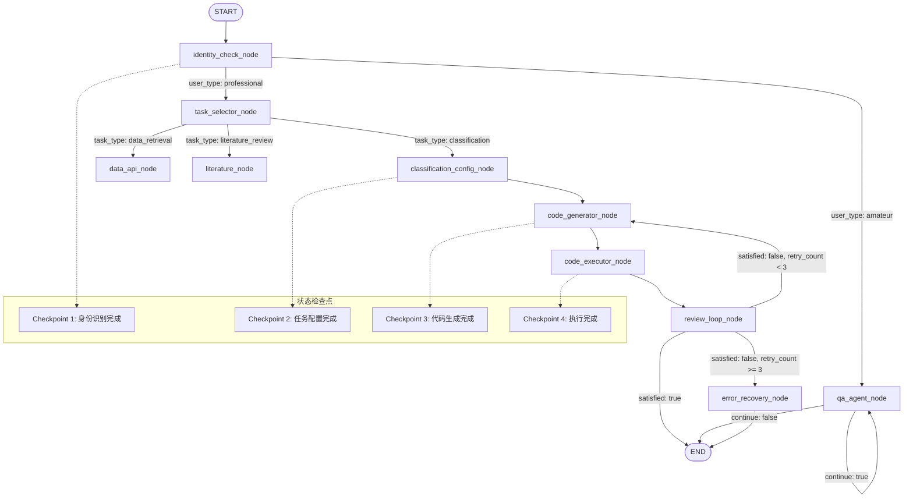

# 天文科研Agent系统产品需求文档

## 1. 产品概述

本系统是一个基于LangGraph状态图架构构建的面向天文科研领域的智能Agent系统，采用节点式工作流设计，实现了从传统的"单向处理流水线"到"状态驱动的协作式任务执行"的架构升级。系统通过LangGraph的状态管理和检查点机制，支持复杂的多轮对话、任务中断恢复、错误自动处理等高级功能，为不同用户群体提供可靠的科研任务支持和智能代码生成执行服务。

**LangGraph架构优势：**
- **状态持久化**：支持长时间任务的中断和恢复
- **节点式设计**：每个功能模块作为独立节点，便于维护和扩展
- **动态路由**：基于用户输入和状态自动选择执行路径
- **错误恢复**：内置重试机制和降级策略，提升系统稳定性

## 2. 核心功能

### 2.1 用户角色

| 角色 | 识别方式 | 核心权限 |
|------|----------|----------|
| 专业研究人员 | 对话识别 | 可使用分类任务、数据检索、文献综述等高级功能 |
| 天文爱好者/学生 | 对话识别 | 可进行天文知识问答，获取科普信息 |

### 2.2 LangGraph节点模块

本系统基于LangGraph状态图架构，将功能模块设计为独立的执行节点：

1. **身份识别节点（identity_check_node）**：系统入口节点，通过LLM对话识别用户类型
2. **任务选择节点（task_selector_node）**：为专业用户提供任务路由和功能导航
3. **QA问答节点（qa_agent_node）**：为非专业用户提供天文知识咨询服务
4. **分类配置节点（classification_config_node）**：交互式配置天体分类任务参数
5. **代码生成节点（code_generator_node）**：根据配置自动生成Python分析代码
6. **代码执行节点（code_executor_node）**：在安全沙箱环境中执行生成的代码
7. **审查循环节点（review_loop_node）**：评估结果质量，支持迭代优化

**节点间状态传递：**
- 所有节点共享`AstroAgentState`状态对象
- 支持状态检查点保存和恢复
- 动态路由基于状态内容自动选择下一个执行节点

### 2.3 LangGraph节点功能详情

| 节点名称 | 节点类型 | 功能描述 |
|----------|----------|----------|
| identity_check_node | 入口节点 | 通过LLM对话识别用户身份（amateur/professional），更新状态中的user_type字段 |
| task_selector_node | 路由节点 | 为专业用户提供任务选择（classification/data_retrieval/literature_review），更新task_type状态 |
| qa_agent_node | 终端节点 | 为非专业用户提供天文知识问答，支持多轮对话，维护对话历史 |
| classification_config_node | 配置节点 | 通过多轮对话配置天体分类任务参数（数据源、特征、算法、目标类别） |
| code_generator_node | 生成节点 | 基于配置参数和LLM生成Python数据处理代码，支持代码模板和最佳实践 |
| code_executor_node | 执行节点 | 在Docker沙箱环境中安全执行代码，包含安全检查、资源限制、超时控制 |
| review_loop_node | 评估节点 | 评估代码执行结果质量，收集用户反馈，决定是否重新生成或结束流程 |

**状态管理特性：**
- 每个节点都可以读取和更新`AstroAgentState`
- 支持状态检查点自动保存，任务可中断恢复
- 错误状态自动传播，支持节点级别的重试和降级
- 状态变更历史完整记录，便于调试和审计

## 3. 核心流程

### 3.1 LangGraph状态驱动的用户流程

**专业用户流程（状态图执行）：**
1. **START** → `identity_check_node`：用户输入触发身份识别
2. `identity_check_node` → `task_selector_node`：识别为专业用户，状态路由
3. `task_selector_node` → `classification_config_node`：选择分类任务
4. `classification_config_node` → `code_generator_node`：配置完成，触发代码生成
5. `code_generator_node` → `code_executor_node`：代码生成完成，自动执行
6. `code_executor_node` → `review_loop_node`：执行完成，进入审查阶段
7. `review_loop_node` → **END** 或循环回到步骤4（基于用户反馈）

**非专业用户流程（简化路径）：**
1. **START** → `identity_check_node`：用户输入触发身份识别
2. `identity_check_node` → `qa_agent_node`：识别为非专业用户，直接路由
3. `qa_agent_node` → `qa_agent_node`：支持多轮对话，状态持续更新
4. `qa_agent_node` → **END**：用户主动结束或会话超时

**状态恢复流程：**
- 任何节点执行失败时，系统自动从最近检查点恢复
- 用户可随时中断任务，下次访问时从中断点继续
- 长时间任务支持后台执行，用户可查询进度状态

### 3.2 LangGraph状态图流程

**状态图特性说明：**
- **条件边**：基于状态内容自动路由（如user_type、task_type等）
- **检查点机制**：关键节点完成后自动保存状态
- **错误恢复**：重试次数超限时触发降级处理
- **循环控制**：支持基于状态的循环执行和退出条件

## 4. 用户界面设计

### 4.1 设计风格

- **主色调**：深蓝色（#1e3a8a）和星空银（#e5e7eb），体现天文科研的专业性
- **辅助色**：橙色（#f97316）用于强调和按钮，绿色（#10b981）用于成功状态
- **按钮风格**：圆角矩形，具有轻微阴影效果
- **字体**：主要使用系统默认字体，代码区域使用等宽字体
- **布局风格**：卡片式布局，左侧导航，主要内容区域居中
- **图标风格**：线性图标，简洁现代，与天文主题相关

### 4.2 页面设计概览

| 页面名称 | 模块名称 | UI元素 |
|----------|----------|--------|
| 对话入口页面 | 欢迎界面 | 大标题、系统介绍、身份选择按钮、星空背景 |
| 任务选择页面 | 任务卡片 | 三个主要任务卡片、任务描述、进入按钮、进度指示器 |
| 知识问答页面 | 对话界面 | 聊天气泡、输入框、发送按钮、历史记录、相关推荐 |
| 任务配置页面 | 配置向导 | 步骤指示器、表单字段、选择器、确认按钮、返回按钮 |
| 代码执行页面 | 执行监控 | 代码编辑器、执行日志、进度条、结果预览、下载按钮 |
| 结果审查页面 | 结果展示 | 数据表格、图表可视化、满意度评分、反馈文本框、操作按钮 |

### 4.3 响应式设计

系统采用桌面优先的响应式设计，支持移动端适配。在移动设备上，导航栏折叠为汉堡菜单，卡片布局调整为单列显示，确保在各种设备上都有良好的用户体验。

## 5. 技术需求

### 5.1 LangGraph核心技术栈

- **前端框架**：React 18 + TypeScript
- **状态管理**：LangGraph StateGraph + 检查点持久化
- **UI组件库**：Tailwind CSS + Headless UI
- **后端框架**：Python FastAPI + LangGraph集成
- **AI框架**：LangChain + LangGraph + LangSmith（监控）
- **状态持久化**：PostgresSaver（生产）+ MemorySaver（开发）
- **代码执行**：Docker容器沙箱环境
- **数据库**：PostgreSQL（状态存储 + 用户数据）+ Redis（会话缓存）

**LangGraph特定技术要求：**
- **节点函数**：所有业务逻辑封装为标准LangGraph节点
- **状态类型**：使用TypedDict定义强类型状态结构
- **条件边**：实现基于状态的动态路由逻辑
- **检查点**：配置自动状态保存和恢复机制
- **错误处理**：节点级别的异常捕获和重试策略

### 5.2 外部服务集成

- **天文数据API**：SDSS API、ZTF Data Archive、NASA Exoplanet Archive
- **文献检索**：Google Scholar API、ADS（Astrophysics Data System）
- **AI模型服务**：OpenAI GPT-4、Claude等大语言模型

### 5.3 LangGraph安全与性能要求

**安全要求：**
- **代码执行安全**：Docker容器隔离，资源限制，超时控制
- **状态数据安全**：检查点数据加密存储，状态访问权限控制
- **节点执行安全**：输入验证，输出过滤，恶意代码检测
- **API密钥管理**：环境变量隔离，密钥轮换机制

**性能要求：**
- **节点响应时间**：单节点执行<2秒，复杂节点<10秒
- **状态持久化**：检查点保存<500ms，状态恢复<1秒
- **并发处理**：支持100+并发状态图实例
- **内存管理**：单会话状态<10MB，自动清理过期状态

**LangGraph特定性能优化：**
- **节点缓存**：相同输入的节点结果缓存机制
- **状态压缩**：大状态对象的压缩存储
- **异步执行**：长时间节点的异步处理和进度反馈
- **资源监控**：节点执行时间、内存使用的实时监控

## 6. 系统优化建议

基于当前的系统设计，我建议以下优化方案：

### 6.1 功能增强

1. **任务模板库**：预设常见的天文分类任务模板，减少配置时间
2. **结果可视化**：增加图表和可视化组件，更直观展示分析结果
3. **协作功能**：支持多用户协作，任务分享和结果讨论
4. **历史记录**：保存用户的任务历史和配置，支持快速复用

### 6.2 LangGraph技术优化

1. **状态图优化**：
   - 节点执行路径优化，减少不必要的状态传递
   - 条件边逻辑优化，提升路由决策效率
   - 状态结构优化，减少序列化开销

2. **检查点优化**：
   - 增量检查点保存，只保存变更的状态字段
   - 检查点压缩算法，减少存储空间占用
   - 智能检查点策略，基于节点重要性调整保存频率

3. **错误恢复增强**：
   - 节点级别的细粒度重试策略
   - 状态回滚机制，支持多级回退
   - 降级执行路径，确保核心功能可用性

4. **LangSmith集成监控**：
   - 节点执行链路追踪
   - 状态变更历史记录
   - 性能瓶颈识别和优化建议
   - 用户行为分析和路径优化

### 6.3 用户体验优化

1. **智能推荐**：基于用户历史行为推荐相关任务和参数
2. **快捷操作**：提供键盘快捷键和批量操作功能
3. **帮助系统**：内置教程和帮助文档，降低学习成本
4. **个性化设置**：支持界面主题、语言等个性化配置

这些优化建议可以在MVP版本稳定后逐步实施，以持续提升系统的易用性和功能完整性。